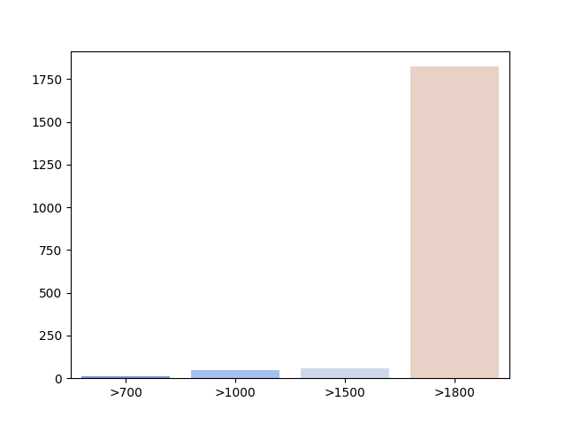

# taggedPBC

**tldr**: POS-tagged and dependency-annotated verses from the Parallel Bible Corpus (PBC; [Mayer & Cysouw 2014](#1)), with Python code for extracting various metrics and making cross-linguistic comparisons.

> This repository is shared under a CC BY-NC-SA 4.0 license, and can be used solely for research purposes. Copyright of the selected verses of each translation is retained by the original copyright holders.

If you use this data, please cite the following source or one (or all) of the papers listed further below:

- Ring, Hiram. 2025. The *taggedPBC*: Annotating a massive parallel corpus for crosslinguistic investigations. https://doi.org/10.48550/arXiv.2505.12560 *[Submitted on 18 May 2025]*

## Aims and Description of the repository

The main aim of this repository is to provide a baseline dataset of parallel annotated corpora for crosslinguistic investigations. A secondary aim is to allow for ongoing annotation of corpora to support NLP for low-resource languages. As annotations are improved it is hoped that this will allow for more detailed comparisons and linguistic insights.

The three folders in this repository contain corpus data and scripts to run various analyses.

- `corpora`: contains the actual annotated data for a large number of (non-contiguous) parallel verses taken from New Testament translations in 1,599 languages of the PBC (including two conlangs: Esperanto and Klingon).
- `recipes`: contains scripts that illustrate how to extract info from the corpora.
- `scripts`: contains scripts to verify and analyze the data of the `taggedPBC`, with reference to particular papers (currently draft versions of submissions to journals). Refer to the `README` file in the subfolder for additional information.

Papers related to this dataset include the following:

- Ring, Hiram. 2025. The *taggedPBC*: Annotating a massive parallel corpus for crosslinguistic investigations. https://doi.org/10.48550/arXiv.2505.12560 *[Submitted on 18 May 2025]* [Annotating README](scripts/annotating_readme.md)

- Ring, Hiram. 2025. Word length predicts word order: "Min-max"-ing drives language evolution. https://doi.org/10.48550/arXiv.2505.13913 *[Submitted on 20 May 2025]* [Word length README](scripts/wordlength_readme.md)

- Ring, Hiram. 2025. Extending dependencies to the *taggedPBC*: Word order in transitive clauses. https://doi.org/10.48550/arXiv.2506.06785 *[Submitted on 6 June 2025]* [CoNLL-U README](scripts/conllu_readme.md)

### How to access data in the repository

Individual corpora can be downloaded from the relevant subfolder. Additionally, there are scripts illustrating how to access data systematically (see the [Recipes README](recipes/README.md) for specifics). This includes accessing information by ISO code or groups of codes (such as language families via Glottolog).

### Information regarding the tagged corpora

Under the subfolder `corpora/json`, the data contains POS-tagged verses formatted as a `json` dict with the following keys:

- `info`: general information about the data
- `license`: information on permitted use and relevant copyright
- `metadata`: the original PBC metadata
- `tagged`: a list of lists, with the first item in each sublist being the verse number (following PBC convention) and the second being a list of tuples in [word, POS] format where `unk` represents unknown tags

Under the subfolder `corpora/conllu` the data contains additional annotations (POS, dependencies, morphological info) formatted following the [CoNLL-U Universal Dependencies conventions](https://universaldependencies.org/format.html). All corpora contain an introductory header with information on licensing and source, followed by specific verses with introductory comments and then the individual tagged words:

- `# sent_id`: the PBC verse number
- `# ref_id`: the book, chapter, verse reference
- `# eng_text`: the English text, from a Public Domain translation
- `# ISO_text`: the text of the source language, where `ISO` is the ISO630-3 code
- `ID`	`word`	`lemma`	`UPOS`	`XPOS` `FEATS`	`HEAD`	`DEPREL`	`DEPS`	`MISC`

 The `MISC` field contains the most likely English gloss based on word alignment, as well as morphological features transferred from English via that gloss.

The following table gives counts of verses per language in the corpora:

|Number of verses|Number of languages|
|--|--|
|1800+|1547|
|1500-1800|21|
|1000-1500|26|
|700-1000|5|
|**Total**|**1599**|

## References 

<a id="1">[1]</a>
Mayer, Thomas & Michael Cysouw. 2014. Creating a massively parallel Bible corpus. In Proceedings of the Ninth International Conference on Language Resources and Evaluation (LREC'14), pages 3158–3163, Reykjavik, Iceland. European Language Resources Association (ELRA). https://aclanthology.org/L14-1215/  
