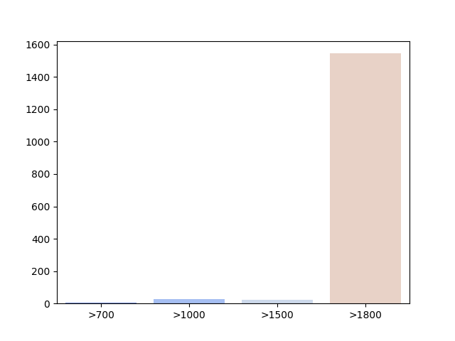
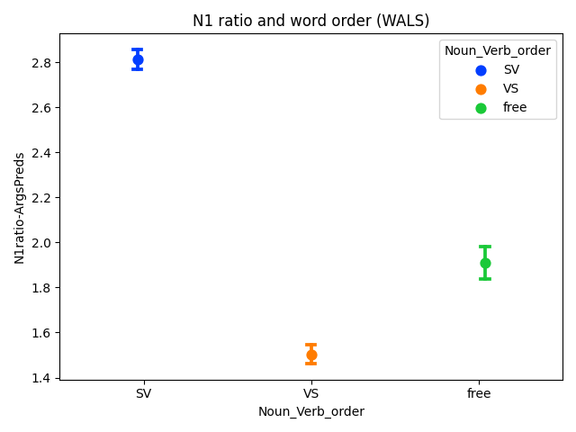
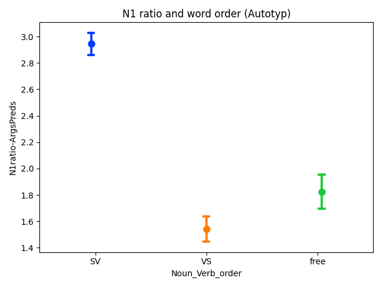
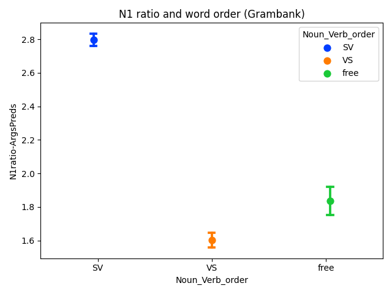
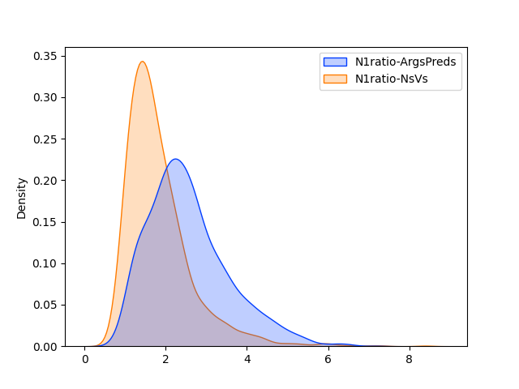
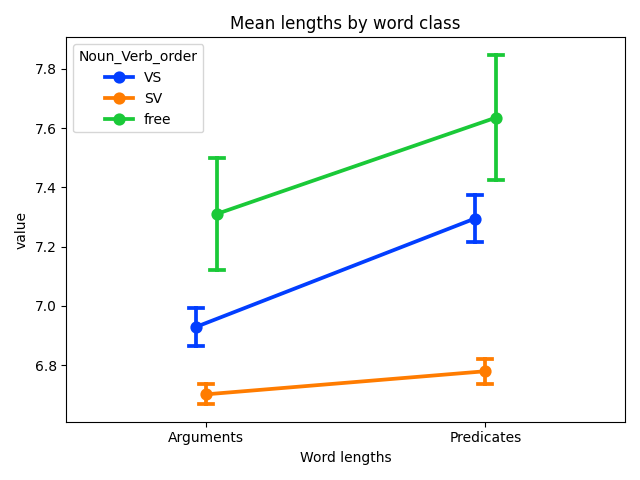
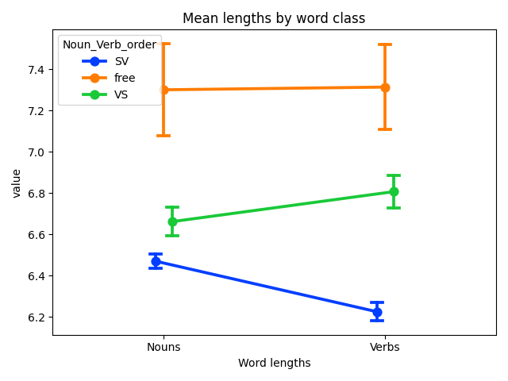

# taggedPBC

**tldr**: POS-tagged verses from the Parallel Bible Corpus (PBC; [Mayer & Cysouw 2014](#1)), with Python code for extracting various metrics and making cross-linguistic comparisons.

> This repository is shared under a CC BY-NC-SA 4.0 license

Findings are based on metrics computed for each language and aggregated in the file `data/output/All_comparisons_imputed.xlsx` - this contains measurements for word types in languages of the tagged PBC. The remainder of this README file describes the process used to obtain these measurements.

To generate the basic stats via this repository, install the requirements (recommended in a virtual environment, Python 3.10.12). These requirements do not include all the libraries used for developing the corpus, dependencies for which can be installed manually following scripts in the `processing` folder:

`pip install -r requirements.txt`

The two scripts in the main folder of this repository can then be used to run the analyses reported in the paper "Word length predicts word order".

`python analyze_taggedPBC.py`  
`python verify_taggedPBC.py`

Explanation of the code and the reasoning behind it continues at length below. The folder structure is as follows:

- The `analysis` folder contains code to conduct ANOVAs, get statistics and patterns from the *tagged PBC*, and train classifiers for imputing word order.

- The `checks` folder contains code for checking the tags in the tagged PBC against existing POS taggers and hand-annotated data, as well as assessing how lengths of Nouns/Verbs predicts word order in (historical) corpora and differentiates word order in relation to descent from a common ancestor. It contains subfolders:  
  - `glottolog`: a folder containing data files sourced from Glottolog with language family and geographic information for the ISO codes in the dataset.
  - `results`: a folder containing correspondence results from comparison of tags with relevant repositories, and results from hierarchical linear regression models.
  - `tag_models`: a folder containing model language codes for the trained taggers.
  - `test_hist`: a folder with code to test word order classification of Ancient/Modern Hebrew and Classical/Egyptian Arabic based on Noun and Verb lengths in corpora.

- The `data` folder contains multiple subfolders:  
  - `output`: a folder to store statistical test results and plots created by scripts in this repository.
  - `tagged`: a folder containing the 1599 POS-tagged portions of Bibles from the PBC (including 2 conlangs).
  - `translation`: a folder containing data used for developing the tagged corpus.
  - `word_order`: a folder containing spreadsheets with word order information from three typological databases (Autotyp, Grambank, WALS). Data that was tagged with a Glottocode has been cross-referenced to identify each language with an ISO 639-3 code.

- The `processing` folder contains code that was used to develop the *tagged PBC*. This code makes use of various data found in the `data` folder.

#### Table of Contents  
[Overview of repository](#overview)  
[Overview of methodology](#methodology)  
&nbsp;&nbsp;[1. Developing the corpus](#develop-corpus)  
&nbsp;&nbsp;&nbsp;&nbsp;[1.1 Automatic POS tagging](#auto-pos)  
&nbsp;&nbsp;&nbsp;&nbsp;[1.2 Assessing accuracy](#accuracy-pos)  
&nbsp;&nbsp;[2. Identifying word order](#id-word-order)  
&nbsp;&nbsp;&nbsp;&nbsp;[2.1 What is word order?](#what-is-word-order)  
&nbsp;&nbsp;&nbsp;&nbsp;[2.2 Identifying word order in corpora](#word-order-in-corpora)  
&nbsp;&nbsp;&nbsp;&nbsp;[2.3 Assessing validity](#assessing-N1-ratio)  
&nbsp;&nbsp;&nbsp;&nbsp;[2.4 Classifying word order](#classifying-word-order)  
&nbsp;&nbsp;[3. Comparing word length and word order](#compare-averages)  
&nbsp;&nbsp;&nbsp;&nbsp;[3.1 Results](#results)  
&nbsp;&nbsp;&nbsp;&nbsp;[3.2 Testing predictive validity](#testing-predictive-validity)  
&nbsp;&nbsp;&nbsp;&nbsp;[3.3 Testing descent](#testing-descent)  
&nbsp;&nbsp;&nbsp;&nbsp;[3.4 Discussion](#discussion)  
&nbsp;&nbsp;[References](#references)  

## Overview of repository 

This repository contains data and code to reproduce the results reported in the paper "Word length predicts word order". There are two collections of Python scripts within this repository.

### Scripts
The first collection of scripts makes use of the *tagged PBC* corpora to derive word order patterns for unclassified languages and aggregate observations of noun/argument and verb/predicate lengths for all languages. The resulting spreadsheet file is then used as the basis for statistical analyses and tests as reported in the paper. To reproduce the analyses from pre-populated spreadsheets, run the `analyze_taggedPBC.py` script. If you have cloned the repository, you can also re-generate the spreadsheets by deleting them from their respective locations. Alternatively, the spreadsheets can be downloaded separately for processing via a statistical tool of your choice. To conduct tests of various kinds, run the `verify_taggedPBC.py` script. These analyses and tests are described in greater detail below and via annotations within the scripts themselves.

The second collection of scripts are those used to develop the *tagged PBC* dataset. The methodology behind this process is laid out further below. There are several dependencies which are not included as part of this repository and require additional manual configuration/downloading.

### Dependencies
The first major set of dependencies include the PBC itself, which is available for research via the authors of the original paper, and the individual translation models developed using IBM Model 2 (via NLTK) with corresponding Sentence Piece PBE Tokenizers. These trained models and tokenizers are collectively ~40 GB in size, and are not hosted in the current Github repository (the resulting tagged corpus of 1599 languages is \*only\* 1.7 GB). However, code is included in this repository to conduct the training and tagging should anyone be interested in fully replicating the results. The training and tagging procedures can be followed via the scripts in the `processing` folder, though they will not work out-of-the-box without the requisite datasets/dependencies.

The second major set of dependencies involve the libraries and databases used to verify the quality of the tags, as well as the alignment of the "N1 ratio" with word order classifications. The tagging libraries include [`SpaCy`](https://spacy.io/) and [`Trankit`](http://nlp.uoregon.edu/trankit), both available via the Python package manager, and the hand-tagged database is the [Universal Dependencies Treebank](http://universaldependencies.org) (UDT; [Zeman et al. 2024](#2)). Both the tagging libraries require additional downloads and the UDT (version 2.14) must be downloaded separately and pre-processed in order to be used for verification (a script is included in the `processing` subfolder to help with this). The data from the sources used for identifying word order (WALS, AUTOTYP, Grambank) have been converted into separate XLSX spreadsheets in this repository for comparison of their coding with the N1 ratio. These are then collated and used to train the classifiers for imputing word order for the remaining (unclassified) languages in the tagged PBC. The verification procedure can be followed by running the `verify_taggedPBC.py` script and requires fewer datasets/dependencies.

## Overview of methodology for tagging the PBC 

There are several parts to the methodology developed to carry out investigation of crosslinguistic patterns in word length and word order, and these are laid out in detail here.

### 1. Develop a corpus of POS-tagged sentences for a large number of languages 

Previous investigations into word order in languages of the world have worked with a relatively small number of languages (the largest sample to date is by [Hahn & Xu 2022](#3) who investigated 80 languages). This makes it difficult to assess general claims about the properties of human language. In order to address this, we can use the large Parallel Bible Corpus (PBC; [Mayer & Cysouw 2014](#1)), which has recently been updated to contain portions of the Bible in over 2000 languages. Of these, 1597 modern languages (excluding 2 conlangs) have at least 3000 verses of the New Testament translated into the language. Unfortunately, these translations have not been tagged for part of speech.

`processing/PBC_parseBibles.py`

The languages in the PBC use several different writing systems and scripts. Some, like Devanagari, are syllabic, while others, like Arabic, are phonetic, and yet others, like Chinese, are systems that use individual characters to represent words or syllables. In order to ensure that we can adequately compare languages in terms of their sound structure, we can
convert all disparate systems to romanized script using the [`uroman`](https://www.isi.edu/~ulf/uroman.html) tool, with the addition of word tokenizers for particular scripts where words are not clearly separated by whitespace ([`fugashi`](https://github.com/polm/fugashi) for
Japanese, [`khmernltk`](https://github.com/VietHoang1512/khmer-nltk) for Khmer/Kuy, [`jieba`](https://github.com/fxsjy/jieba) for Chinese, [`pyidaungsu`](https://github.com/kaunghtetsan275/pyidaungsu) for Burmese/Karen/Mon,
[`attacut`](https://github.com/PyThaiNLP/attacut) for Thai , [`botok`](https://github.com/OpenPecha/Botok) for Tibetan) before converting to romanized script. The code `PBC_parseBibles.py` does this conversion for New Testament portions of Bibles in the PBC, though the original corpus is not included in the current repository.

#### 1.1 Automatic POS tagging using cross-lingual transfer 

Transferring POS tags from high-resource languages has been shown to work relatively well for word classes with many members, such as Nouns and Verbs ([Agic et al 2015](#4); [Imani et al 2022](#5)). To transfer tags for languages in the PBC I trained IBM Model 2 to translate words between each source language and English. IBM Model 2 is a statistical word alignment model that is agnostic to the order of words, which makes it ideal for this situation, where we are dealing with languages for which we don't know the word order.

`processing/get_indices.py`, `processing/train_models.py`

To increase the odds of successfully identifying Nouns and Verbs for unknown languages, I utilize the following methods:
1. Reduce the number of verses in the corpus to a) those which share at least 4 lemmas in 2 English translations, then further reduce to verses where b) a verb occurs that is also present in at least five other verses, resulting in 1885 verses for training our word alignment models.
  - criteria a) ensures that verses are likely to be semantically accessible. Translations chosen for this comparison are the New Living Translation (NLT) and the New International Version (NIV), after discussions with Bible translators. Translators indicated that these two versions are often consulted for their readability and accessibility in terms of how they translate the original Greek text.
  - criteria b) increases the likelihood that each individual Bible translation has common words. This should help improve the quality of the statistical word alignment model.
2. Train subword tokenizers for each language.
  - I used the `MarianMT` subword tokenizer as a base architecture, which has been developed for machine translation between multiple languages. Specifically, I used the `SentencePieceBPETokenizer` without lowercasing (from the `transformers` library) and retrained on each language.
  - by training subword tokenizers for a single language, we are allowing the tokenizer to identify sub-word units (that could hypothetically correspond to morphemes), which should enhance the ability of the statistical word alignment model to identify correspondences (alignments) between words in the pairs of languages.
3. Train the model with the `source` being the non-English language and the `target` being English.
  - this enables a direct mapping of the words in the source language verse to the English words, allowing us to extract POS tags easily from words in the POS-tagged English sentence (via the `SpaCy` library).

This methodology allows us to tag 1885 verses for a large number of languages in the PBC. Due to some differences in how sentences/clauses are translated between languages, and some portions not being available for some languages, there are a few mismatches. We can examine the actual number of sentences and sort them into bins (see code in `analyze_taggedPBC.py`), which gives us the following counts of verses/languages in the corpus:

|Number of verses|Number of languages|
|--|--|
|1800+|1547|
|1500-1800|21|
|1000-1500|26|
|700-1000|5|
|**Total**|**1599**|

#### 1.2 Assessing the accuracy of the POS tags 

For the purposes of cross-linguistic comparison, I employ [the Universal Dependencies tag set for parts of speech](https://universaldependencies.org/u/pos/all.html) which includes 6 open classes (ADJ ‘adjective’, ADV ‘adverb’, INTJ ‘interjection’, NOUN ‘noun’, PROPN ‘proper noun’, VERB ‘verb’), 8 closed classes (ADP ‘adposition’, AUX ‘auxiliary’, CCONJ ‘coordinating conjunction’, DET ‘determiner’, NUM ‘numeral’, PART ‘particle’, PRON ‘pronoun’, SCONJ ‘subordinating conjunction’) and 3 ‘other’ classes for handling characters (PUNCT ‘punctuation’, SYM ‘symbol’, X ‘other’). These 17 classes, while not used by all languages, provide enough of a basic tag set to allow for cross-linguistic comparison.

The process in 1.1 gives us a POS-tagged corpus of 1885 verses for the majority of the 1597 languages in the PBC. But how can we assess the accuracy of these tags? In our case, we are not particularly concerned with the accuracy of tags other than Noun (and other arguments) and Verb (and other predicates), so we can focus specifically on these.

To check how accurate the tags are for these word classes, I compare the tags derived via this method with tags produced by state of the art POS taggers as well as those produced by human coders for various languages. Trained POS taggers exist for multiple languages in the `SpaCy` and `Trankit` libraries. Hand-tagged corpora exist for multiple languages in the `Universal Dependencies Treebank`.

##### 1.2.1 Comparing POS tags in newly-tagged PBC with trained POS taggers (`verify_taggedPBC.py`)

State of the art pos-taggers have been developed for high-resource languages via the [SpaCy](https://spacy.io/) and [Trankit](http://nlp.uoregon.edu/trankit) text processing libraries. These libraries have supervised pos-taggers for 16 and 31 languages respectively (excluding languages with non-roman scripts). For this comparison, each of the trained taggers was used to tag the reduced PBC verses for the respective language and then compared with the same verses tagged via the word alignment method. Correspondence with verb and noun tags between the word alignment method and these pos-taggers was on average above 75% for both SpaCy (nouns: 0.84; verbs: 0.76) and Trankit (nouns: 0.84; verbs: 0.76).

`checks/results/Spacy_correspondences.xlsx` (Delete this file if you wish to re-run the correspondence checks. This will require you to have the SpaCy library installed [`pip install spacy`], and relevant language models will be downloaded.)

Correspondence of PBC (Noun/Verb) POS tags with SpaCy taggers:

|ISO 639-3|Language|Nouns|Verbs|
|--|--|--|--|
|cat|Catalan|0.85|0.76|
|hrv|Croatian|0.76|0.56|
|dan|Danish|0.87|0.84|
|nld|Dutch|0.92|0.87|
|fin|Finnish|0.90|0.80|
|fra|French|0.85|0.67|
|deu|German|0.87|0.84|
|ita|Italian|0.87|0.80|
|lit|Lithuanian|0.82|0.63|
|nob|Norwegian Bokmål|0.91|0.86|
|pol|Polish|0.82|0.65|
|por|Portuguese|0.84|0.78|
|ron|Romanian|0.75|0.66|
|slv|Slovenian|0.60|0.72|
|spa|Spanish|0.88|0.88|
|swe|Swedish|0.90|0.79|
| |**Average**|**0.84**|**0.76**|

`checks/results/Trankit_correspondences.xlsx`  (Delete this file if you wish to re-run the correspondence checks. Re-running the checks will require you to have the Trankit library installed [`pip install trankit`], and relevant language models will be downloaded.)

Correspondence of PBC (Noun/Verb) POS tags with Trankit taggers:

|ISO 639-3|Language|Nouns|Verbs|
|-----|-----|-----|-----|
|afr|Afrikaans|0.94|0.89|
|eus|Basque|0.69|0.78|
|bul|Bulgarian|0.81|0.70|
|cat|Catalan|0.84|0.88|
|hrv|Croatian|0.76|0.70|
|ces|Czech|0.77|0.71|
|dan|Danish|0.86|0.90|
|nld|Dutch|0.92|0.89|
|fin|Finnish|0.92|0.84|
|fra|French|0.87|0.82|
|deu|German|0.90|0.86|
|hun|Hungarian|0.91|0.68|
|ind|Indonesian|0.88|0.65|
|gle|Irish|0.82|0.46|
|ita|Italian|0.88|0.83|
|lat|Latin|0.86|0.73|
|lav|Latvian|0.91|0.82|
|lit|Lithuanian|0.88|0.76|
|nob|Norwegian (Bokmål)|0.91|0.89|
|nno|Norwegian (Nynorsk)|0.90|0.84|
|pol|Polish|0.83|0.65|
|por|Portuguese|0.86|0.80|
|ron|Romanian|0.76|0.80|
|gla|Scottish Gaelic|0.84|0.56|
|srp|Serbian|0.75|0.73|
|slk|Slovak|0.76|0.73|
|slv|Slovenian|0.60|0.75|
|spa|Spanish|0.89|0.90|
|swe|Swedish|0.89|0.90|
|tur|Turkish|0.85|0.60|
|vie|Vietnamese|0.86|0.69|
||**Average:**|**0.84**|**0.76**|

This comparison informs us that the translation method is relatively robust at transferring tags from English to other languages. At least for tagging Nouns and Verbs, it aligns pretty well with automatic taggers individually developed for specific languages.

##### 1.2.2 Comparing POS tags in newly-tagged PBC with hand-tagged corpora (`verify_taggedPBC.py`)

`checks/results/UD_correspondences.xlsx`

While comparison with state-of-the-art POS-taggers provides a decent measure of the validity of classes assigned to words by the machine translation method, there is a possibility that the automated taggers I compared with are themselves prone to error. To check this, I compare the tagged PBC data with hand-annotated (“gold standard”) corpora via the Universal Dependencies Treebanks (UDT; [Zeman et al. 2024](#2)). These are collections of data for individual languages that have been annotated for part of speech tags by experts in those languages for investigation of grammatical dependencies, among other things (in this comparison, UDT corpora in non-Roman scripts were first romanized using the `uroman` tool as done for the PBC).

If the method used to tag the PBC results in words with tags corresponding to words and tags in the UDT for a given language (exact matches), we can surmise that other words in the PBC with the same tags are highly likely to belong to the same class. Somewhat surprisingly, this indeed is the case. Despite the PBC being a rather different genre of texts than those that make up the UDT corpora, there are words with the exact same form and tag for every one of the 96 languages shared by the two corpora where the UDT has at least 200 sentences.

In fact, there are only two languages with only one or no predicates that match in form and POS tag: Urdu (ISO 639-3: urd) which shares one verbal form (*kin*) between the two tagged corpora, and Apurinã (ISO639-3: apu) which shares none. When we investigate these more closely, it turns out that in the Urdu UDT there are no diacritics to mark vowels, whereas the Urdu PBC corpus contains diacritics that allow for insertion of vowels in the romanized script. For Apurinã, it seems that the two corpora use different characters for different vowel sounds (so PBC *popı̃kari* corresponds to UDT *pupỹkary*). Despite these differences in spelling conventions, the Urdu UDT additionally shares two nouns with the PBC (*shak*, *din*) while
the Apurinã UDT shares five nouns with the PBC (*tirikapi*, *arẽka*, *kãkiti*, *itixi*, *mãkatxi*). A full list of noun/verb matches between languages found in both corpora is located at `checks/results/UD_correspondences.xlsx`.

#### Summary of section 1

The two points of comparison (between automated taggers on the one hand and hand-tagged corpora on the other) indicate that the machine translation method for tagging parts of speech for low-resource languages in the PBC is a valid approach: it largely aligns with POS taggers for high-resource languages and at the same time identifies real arguments and predicates as found in hand-tagged data.

### 2. Identify word order for languages in the tagged corpus 

The second hurdle to overcome in this investigation regards the identification of "word order" for the languages in our corpus. There are several important points to make here related to what "word order" refers to, and how we can develop a corpus-based measure that allows us to compare the languages in our corpus.

#### 2.1 What is word order? 

By “word order” most researchers refer to the relative order of referential arguments (nouns) versus predicates (verbs), such that it is possible to talk about “verb-initial” vs “verb-final” or “verb-medial” languages, as well as grammatical constructs like Subject and Object in relation to the position of the Verb. Here, we are not strictly talking about the "noun" and "verb" word class, since Subjects and Objects are often pronouns or demonstratives rather than bare nouns. Predicates, similarly, are not solely verbs in all languages.

This means that we can combine several tags (NOUN ‘noun’, PROPN ‘proper noun’, PRON ‘pronoun’) under the 'noun' class and several tags (VERB ‘verb’, AUX ‘auxiliary’) under the 'verb' class.

An additional consideration is what relationship regarding word order we want to test. The end goal is to understand whether word class length has an impact on word order. For this we want to test the hypothesis that 'short' word classes occur before 'long' word classes, which follows from a claim by [Wasow (2002)](#6) that short strings precede long strings crosslinguistically. This means that we can concern ourselves only with the intransitive word orders: whether a language is SV (Subject Verb) or VS (Verb Subject).

#### 2.2 Identifying word order in corpora via the N1 ratio (`analyze_taggedPBC.py`) 

In order to identify these relations in corpora I use the following procedure for each language in the tagged PBC corpus:

1. Make lists of all the verses in the corpus, filtering out verses/sentences which do not contain both a noun and a verb.
2. In the resulting set, verses/sentences with a noun/argument occurring first are considered to be “noun first”, while those with a verb/predicate occurring first are considered “verb first”.
3. This gives a count of noun-first and verb-first verses/sentences for each language.
4. Turn this into the “N1 ratio” by dividing the total number of
noun-first verses/sentences by the total number of verb-first verses/sentences.

The resulting scalar value (the “N1 ratio”) allows us to make a plausible quantitative inference based on observation of actual text data, rather than making a categorical judgement on a language based on our knowledge of it (which may be limited or
expansive depending on the particular language).

#### 2.3 Assessing the validity of the N1 ratio (`verify_taggedPBC.py`) 

The N1 ratio gives a proportion of N-initial sentences in a corpus, but how valid is this measure? To test whether it actually identifies word order in language, I compare it with classification of languages as SV or VS in existing typological databases: the World Atlas of Language Structures ([WALS](https://wals.info/); [Dryer & Haspelmath 2013](#7)), the [AUTOTYP](https://github.com/autotyp/autotyp-data) database ([Bickel et al., 2022](#8)), and [Grambank](https://grambank.clld.org/) ([Skirgård et al., 2023](#9)). These databases contain determinations of word order in many of the languages contained in our *tagged PBC* corpus (WALS: 566 languages; AUTOTYP: 180 languages; Grambank: 791 languages), allowing us to compare the N1 ratio in the corpus with the SV/VS classification in these databases. An important point here is that some of the values in these databases need to be converted to the basic SV/VS classification, and these databases also contain a third value: "free" word order. This gives us 3 terms to compare with the N1 ratio: "SV" (argument-initial), "VS" (predicate-initial), and "free" (no dominant order).

##### 2.3.1 Comparisons with WALS

The WALS database “is a large database of structural (phonological, grammatical, lexical) properties of languages gathered from descriptive materials (such as reference grammars) by a team of 55 authors” (Dryer & Haspelmath, 2013). There are 2,498 languages or lects with coded data in the database, of which 1,367 unique lects (varieties that are identified with unique ISO 639-3 codes) have information regarding the order of Subject and Verb, where languages are identified as “SV” (noun first), “VS” (verb first) or “No dominant order” (free). Of these, 566 have translations found within the PBC.

To determine the degree to which the “N1 ratio” aligns with these expert codes regarding order of Subject and Verb, I conducted an analysis of variance (one-way ANOVA) with the N1 ratio as the dependent variable, and the WALS category as the grouping variable. For the 566 shared languages, there was a clear and significant distinction between languages identified as SV in the WALS database (noun first) and VS (verb first) languages  (p < 0.001), on the basis of the N1 ratio. There was also a significant difference between SV and “free” word order languages (p < 0.001), and between “free” and VS languages (p < 0.001). This means that the N1 ratio effectively differentiates between these languages at least as well as the expert judgements maintained in the WALS database.

##### 2.3.2 Comparisons with Autotyp

The AUTOTYP database is a set of linguistic data that depends “on an automatic generation of category lists during data input” (Bickel et al., 2022). It contains typological information on 2,830
languages, of which 452 have information on word order; 180 of these are also found in the PBC. The AUTOTYP database identifies languages as “V=1” (verb first), “V=2” (verb second), “V=3” (verb third), or “free” (no dominant order). For our purposes, we consider both “V=2” and “V=3” languages to be “SV”, while “V=1” is “VS”, allowing for comparison with the N1 ratio.

For these languages, I conducted an ANOVA with the N1 ratio derived from the tagged PBC as the dependent variable and the “SV” (141 languages), “VS” (25 languages) and “free” (14 languages) categories as the grouping variables. Similarly to the WALS database, the N1 ratio significantly differentiated between “SV” languages and both “VS” and “free” languages (p < 0.001), but unlike the previous comparison it did not significantly differentiate “free” languages from “VS” languages (p = 0.088).

##### 2.3.3 Comparisons with Grambank

The Grambank database is a set of linguistic data that “currently covers 2,467 language varieties, capturing a wide range of grammatical phenomena in 195 features, from word order to verbal tense, nominal plurals, and many other well-studied comparative linguistic variables” (Skirgård et al., 2023). It contains word order information on 2,320 languages (features GB130-GB136), 900 of which are also found in the PBC. Of these languages, an additional 109 languages have “UNK” as the word order feature, leaving 791 for comparison.

For these languages, I conducted an ANOVA with the N1 ratio derived from the PBC as the dependent variable and the “SV” (606 languages), “VS” (147 languages) and “free” (38 languages) categories as the grouping variables. Similarly to the AUTOTYP database, the N1 ratio significantly differentiated between “SV” languages and both “VS” and “free” languages (p < 0.001). It also significantly distinguished “free” languages from “VS” languages (p = 0.019).

##### Summary of N1 ratio findings

These comparisons show that the N1 ratio successfully differentiates between SV and VS languages (as well as "free" word order languages to a large degree), allowing us to use it as a valid corpus-based measure for classification. It should be noted that while the measure is valid for the current dataset, it is not clear whether it is also valid for other kinds of (non-parallel) corpora - a good topic for future investigation.

#### 2.4 Classifying word order for unknown languages (`verify_taggedPBC.py`) 

Given the strong correlations between the N1 ratio and SV/VS/free word order patterns, we can also use this measure to infer or impute word order for languages in the PBC for which word order is unknown. To do so, we can train one or more classifiers on the values of the N1 ratio for languages in which SV/VS/free word orders are known, and then use these models to predict on the unknown languages.

Since the tagged PBC data is normally distributed (see the `analyze_taggedPBC.py` script for more verification of this via bootstrapping), I trained a Gaussian Naive Bayes (GNB) classifier on the 976 languages with known word order (with the N1 ratio as the feature), and then predicted on the remaining 621 languages with unknown word order. This resulted in 510 of the languages being classified as "SV", and 111 being classified as "VS". Initial tests with other classifiers gave similar results, though some (like the Decision Tree) classified up to 10 previously unclassified languages as "free". When internet searches were conducted for these languages, existing literature identified all of the languages as having "VS" basic word order, validating the GNB classification.

### 3. Compare average word lengths and word order across languages (`analyze_taggedPBC.py`) 

The preceding investigation has established that based on corpora we can (with a high degree of certainty):

1. identify word classes for nouns/arguments and verbs/predicates for languages, and
2. identify word order for languages

Now we can proceed to an investigation of the primary hypothesis, based on Wasow's (2002) claim, that shorter words/classes occur first in a sentence crosslinguistically. This would suggest that SV languages have shorter nouns/arguments than verbs/predicates and VS languages have longer nouns/arguments than verbs/predicates, while free word order languages do not have shorter nouns/arguments than verbs/predicates.

To investigate this, we can simply count the number of nouns/arguments and get an average of their lengths in each language, and do the same for verbs/predicates. Then we can conduct statistical tests (a repeated measures ANOVA) to see if there is a significant effect of these measures in relation to (SV, VS, free) word order.

There are several conditions that we can consider in our investigation, and which the methodology used to construct the tagged PBC dataset makes relatively easy to test. For example, we know that 'noun' is a subclass of "argument" in languages of the world, such that the latter is a larger group of words that contain pronouns and other referential words such as demonstratives and proper nouns (or names). We also know that 'verb' is a subclass of "predicate", such that words classed as auxiliaries can also serve verbal functions. Another consideration is that there is known to be a frequency effect on word processing ([Brysbaert et al 2018](#10)), which should be taken into account when investigating words in a corpus.

Each of these considerations can be dealt with in our investigation by simply adjusting how we count words and measure lengths. This results in the following four conditions:

1. Arguments/Predicates: count unique [NOUN, PRO, PROPN] and [VERB, AUX] for each language, average their lengths
2. Arguments/Predicates Freq: count all [NOUN, PRO, PROPN] and [VERB, AUX] for each language, average their lengths
3. Nouns/Verbs: count unique [NOUN] and [VERB] for each language, average their lengths
4. Nouns/Verbs Freq: count all [NOUN] and [VERB] for each language, average their lengths

For conditions 1 and 3, we are getting the unique set of Argument(s)/Noun(s) and Predicate(s)/Verb(s) but differentiating based on the members of each class to see if there is an effect of average word length on word order. For conditions 2 and 4, we are instead seeing if word frequency (i.e. frequency of shorter/longer words in each class within the corpus) mediates an effect of average word length on word order.

#### 3.1 Results 

The results are quite striking, with all conditions except for #4 showing a main effect whereby nouns/arguments are shorter than verbs/predicates in all languages (p < 0.001). Further, nouns/verbs tend to be shorter in SV languages than VS languages, and shorter in VS languages than free word order languages.

The only condition where this is not the case is where we compare only nouns/verbs and allow for frequency effects. That is, when we consider only words tagged as nouns (excluding pronouns and proper nouns) and only words tagged as verbs (excluding auxiliaries), and allow for their relative frequencies to affect the average length of the word class (i.e. a higher frequency of a particular short noun brings the average length of nouns down), we see the opposite pattern. In this condition, nouns are shorter than verbs in VS languages, while nouns are longer than verbs in SV languages, and this length difference is significant (p < 0.001).

#### 3.2 Testing predictive validity of word lengths (`verify_taggedPBC.py`) 

This finding suggests that word class length is a factor in how word order is realized in language, but how real is this apparent effect? One way of assessing the strength of this effect is to see whether the relative length of nouns and verbs can predict word order in corpora. That is, can we determine, based on just the relative length of nouns and verbs in tagged corpora, what the language's basic word order is? To investigate this question we can test how well a classifier is able to identify different word orders based on this feature.

Further, with historical corpora, if we can identify a language in which word order has changed from a previous pattern, being able to differentiate the two states would also demonstrate the likely interaction of word length change with word order change. As an example, Ancient Hebrew had a VS basic word order, but Modern Hebrew is SV. Can we use corpora of these two languages to answer this question? In fact, yes: it turns out that the UDT contains tagged corpora for both Ancient Hebrew (ISO639-3: hbo) and Modern Hebrew (ISO639-3: heb). As a second verification step I additionally sourced data from two other related languages where word order changed: Classical Arabic (here I give it the unassigned abbreviation `cla`) and Egyptian Arabic (ISO639-3: arz). Classical Arabic (the language of the Quran) is VS like many other Semitic languages. It was brought to Egypt in the seventh century CE and subsequently developed into modern Egyptian Arabic, which is SV. Data for Classical Arabic was taken from the POS-tagged [Quranic Arabic Corpus V0.4](https://corpus.quran.com/). Data for Egyptian Arabic are from the tagged [BOLT Egyptian Arabic Treebank - Discussion Forum](https://catalog.ldc.upenn.edu/LDC2018T23). Statistics taken from these corpora in the same manner as for the tagged PBC are stored in `checks/test_hist/corpora_stats.xlsx` (the process can be replicated by running `checks/test_hist/check_corpora.py`, provided you have processed the corpus files appropriately), and running the code `checks/test_hist/classify_lgs.py` trains a GNB classifier and outputs the results. The following table displays some of the statistical properties of the respective corpora.

| Language | ISO 639-3 | Data Source | Sentences | Unique nouns | Unique verbs |
| --------- | ----- | ------ | ------ | ------ | -------- |
| A. Hebrew | hbo   | UDT    | 409    | 734    | 782      |
| M. Hebrew | heb   | UDT    | 882    | 2,068  | 1,297    |
| C. Arabic | cla   | Quran  | 6,236  | 8,243  | 7,966    |
| E. Arabic | arz   | BOLT   | 31,688 | 16,698 | 10,581   |

Importantly, 3 additional features are added to the training data besides the average lengths of Nouns/Verbs for each language, in order to expand the dimensionality of the construct. The first is a categorical feature: whether Nouns or Verbs in a language are longer. The second is a continuous feature: the ratio of noun length to verb length. This measure is related to "entropy", whereby a lower ratio indicates that the two word classes are less likely to be differentiable (and therefore predictable) based on their length. The third added feature is also continous: the difference between lengths of nouns and verbs in each language. This measure is related to "efficiency", based on the idea that a larger difference between word classes may affect the likelihood of that particular class being placed first.

Training the model with these five features on the known word order data from the typological databases gives an accuracy of 66% on the test set, while training with the imputed word order gives an accuracy of 68%. In both cases, the trained classifier accurately classifies Ancient Hebrew as VS, Modern Hebrew as SV, Classical Arabic as VS, and Egyptian Arabic as SV, based on the data extracted from the respective corpora.

#### 3.3 Testing descent from a common ancestor (`verify_taggedPBC.py`) 

In an influential paper, [Dunn et al (2011)](#11) showed that descent from a common ancestor was a better predictor of a large number of grammatical patterns than other explanations. Although [Jäger & Wahle (2021)](#12) counter this finding with additional data, we can also assess this claim using the current dataset to see if descent is more explanatory of word order for a given language than the lengths of nouns and verbs. This investigation can proceed with several (motivated) simplifying assumptions regarding the family relationships.

First, for each language we can take the highest level node of family membership that is known based on current scholarship. This is because all modern languages are the same age, and while their pathways/histories may differ, this does not impact whether they can be considered part of the same related tree. That is, if descent is more explanatory than word class length, we would expect languages belonging to the same tree to have a higher likelihood of sharing the same word order than not.

Second, we can run various analyses with differing datasets in order to see how this affects the statistical robustness of the findings. It may be, for example, that using a smaller sample gives a different result than a larger or more diverse one. Here, the more languages we have for a language family, the higher the likelihood that any relationship identified is not due to chance.

Finally, we can remove languages with "free" word order from consideration, as this leaves us with a binary distinction in word order (SV-VS) that opens up more possibilities for statistical tools.

In particular, the use of a binary dependent variable for word order means we can use a statistical method called "hierarchical linear regression". This technique allows us to observe the relative impact of particular features that are theoretically relevant to the question at hand by seeing how they influence the performance of successive models. In the case of word order, we can train a regression model with a feature known to be relevant to word order (the N1 ratio), and then subsequent models that incorporate additional features of interest ("language area", "family membership", "noun/verb lengths"). We can then compare the models to see whether the additional features increase the variance explained in the data via the F-score: an increase in F-score and its significance indicates more variance explained by the particular feature added in a model.

Accordingly, using the ISO codes, I retrieved the family membership for all languages in the taggedPBC from [Glottolog](https://glottolog.org/). Then I filtered the taggedPBC data on four conditions:
1. `Dunn_lgs_tPBC`: languages found in the Dunn et al paper that are also present in the taggedPBC (106 languages)
2. `Dunn_fams_tPBC`: languages found in the taggedPBC that are in the four families investigated by Dunn et al (539 languages)
3. `>75_lg_families`: languages in families with more than 75 members in the taggedPBC (962 languages)
4. `>1_lg_families`: languages in families with 2 or more members in the taggedPBC (1486 languages)

For each of these conditions, we can run a hierarchical linear regression (`checks/hierlinreg.py` or via `verify_taggedPBC.py`) with the N1 ratio as primary feature of the base model, then incorporate language area (a combination of macro area and GPS coordinates as identified by Glottolog) as a feature in the second model, add in the feature of family membership (descent) to the third model, and then noun/verb lengths (frequency weighted) to the fourth model. This gives us the following results:

 Dunn_lgs results:

 |Model|N (obs)|F-val|P-val (F)|F-val change|P-val (F-val change) |
 |-----|-------|-----|---------|------------|---------------------|
 |1    |106    |45.84|7.8e-10  |            |                     |
 |2    |106    |20.40|2.4e-12  |8.58        |3.9e-05              |
 |3    |106    |16.69|5.7e-12  |1.47        |0.226                |
 |4    |106    |13.40|4.9e-12  |3.26        |0.042                |

 Dunn_fams results:

 |Model|N (obs)|F-val|P-val (F)|F-val change|P-val (F-val change) |
 |-----|-------|-----|---------|------------|---------------------|
 |1    |539    |230.40|1.4e-43 |            |                     |
 |2    |539    |100.00|1.7e-63 |39.86       |2.9e-23              |
 |3    |539    |80.71 |5.3e-63 |2.45        |0.117                |
 |4    |539    |64.75 |3.5e-67 |14.57       |6.9e-07              |

 \>75_lg_families results:

 |Model|N (obs)|F-val |P-val (F) |F-val change|P-val (F-val change) |
 |-----|-------|------|----------|------------|---------------------|
 |1    |962    |426.73|9.9e-79   |            |                     |
 |2    |962    |220.48|4.2e-134  |105.35      |6.1e-59              |
 |3    |962    |176.22|6.6e-133  |0.041       |0.839                |
 |4    |962    |130.93|8.3e-135  |9.69        |6.7e-05              |

 \>1_lg_families results:

 |Model|N (obs)|F-val  |P-val (F) |F-val change |P-val (F-val change) |
 |-----|-------|-------|----------|-------------|---------------------|
 |1    |1486   |586.46 |1.8e-109  |             |                     |
 |2    |1486   |193.60 |1.3e-133  |45.19        |6.0e-28              |
 |3    |1486   |155.09 |1.2e-132  |1.03         |0.309                |
 |4    |1486   |115.43 |3.5e-135  |11.02        |1.7e-05              |

From these analyses we can see that the length of nouns and verbs in a language accounts for more variance and at the same time is more significant than that language's family membership in determining its word order classification.

#### 3.4 Discussion 

The results suggest some interesting nuances to the discussion of processing and word order. First, Wasow's claim is supported to some degree, in that when we consider "arguments" as a larger class, the tendency crosslinguistically is for such arguments to be shorter than verbs/predicates. Given that non-noun arguments (pronouns, proper nouns) are quite frequent in usage, this may provide some pressure (via the principle of "efficiency") for languages to place such items first in a sentence.

The surprising finding that nouns (on their own) are longer than verbs (on their own) in SV languages, and that the opposite is true for VS languages, suggests another pressure whereby languages present more difficult-to-process information (or perhaps words that are more informative) first. This may provide an explanation for why VS languages are relatively stable despite the pressure provided by the use of easy-to-parse non-noun arguments.

Additionally, it is quite striking that measuring the length of nouns and verbs in corpora can allow us to accurately classify word order in Hebrew and Arabic. The classifier is assessing data rather different from the tagged PBC, taken from two time points in different languages in which word order is known to have changed. This indicates that there is a real effect of word class length on how word order develops over time.

Finally, hierarchical linear regression shows that word class length is more explanatory than family membership in relation to a language's word order.

## References 

<a id="1">[1]</a>
Mayer, Thomas & Michael Cysouw. 2014. Creating a massively parallel Bible corpus. In Proceedings of the Ninth International Conference on Language Resources and Evaluation (LREC'14), pages 3158–3163, Reykjavik, Iceland. European Language Resources Association (ELRA). https://aclanthology.org/L14-1215/  

<a id="2">[2]</a>
Zeman, Daniel, et al. 2024. Universal Dependencies 2.14. LINDAT/CLARIAH-CZ digital library at the Institute of Formal and Applied Linguistics (ÚFAL), Faculty of Mathematics and Physics, Charles University, http://hdl.handle.net/11234/1-5502 (online at https://universaldependencies.org/ )  

<a id="3">[3]</a>
Hahn, M., & Y. Xu. 2022. Crosslinguistic word order variation reflects evolutionary pressures of dependency and information locality, Proc. Natl. Acad. Sci. U.S.A. 119 (24) e2122604119, https://doi.org/10.1073/pnas.2122604119.  

<a id="4">[4]</a>
Agić, Željko, Dirk Hovy, & Anders Søgaard. 2015. If all you have is a bit of the Bible: Learning POS taggers for truly low-resource languages. In Proceedings of the 53rd Annual Meeting of the Association for Computational Linguistics and the 7th International Joint Conference on Natural Language Processing (Volume 2: Short Papers), pages 268–272, Beijing, China. Association for Computational Linguistics. https://aclanthology.org/P15-2044/   

<a id="5">[5]</a>
Imani, Ayyoob, et al. 2022. Graph-Based Multilingual Label Propagation for Low-Resource Part-of-Speech Tagging. In Proceedings of the 2022 Conference on Empirical Methods in Natural Language Processing, pages 1577–1589, Abu Dhabi, United Arab Emirates. Association for Computational Linguistics. https://aclanthology.org/2022.emnlp-main.102/  

<a id="6">[6]</a>
Wasow, Thomas. 2002. Postverbal Behavior. CSLI Publications.  

<a id="7">[7]</a>
Dryer, Matthew S. & Haspelmath, Martin (eds.) 2013.
The World Atlas of Language Structures Online.
Leipzig: Max Planck Institute for Evolutionary Anthropology.
(Available online at http://wals.info )  

<a id="8">[8]</a>
Bickel, Balthasar, et al. 2022. The AUTOTYP database (v1.1.1). https://doi.org/10.5281/zenodo.7976754  

<a id="9">[9]</a>
Skirgård, Hedvig et al. 2023. Grambank v1.0 (v1.0.3) [Data set]. Zenodo. https://doi.org/10.5281/zenodo.7844558 (online at https://grambank.clld.org/ )  

<a id="10">[10]</a>
Brysbaert, M., Mandera, P., & Keuleers, E. 2018. The Word Frequency Effect in Word Processing: An Updated Review. Current Directions in Psychological Science, 27(1), 45-50. https://doi.org/10.1177/0963721417727521  

<a id="11">[11]</a>
Dunn, M., Greenhill, S., Levinson, S. et al. 2011. Evolved structure of language shows lineage-specific trends in word-order universals. Nature 473, 79–82. https://doi.org/10.1038/nature09923  

<a id="12">[12]</a>
Jäger, G. and Wahle, J. 2021. Phylogenetic Typology. Front. Psychol. 12:682132. doi: 10.3389/fpsyg.2021.682132  
