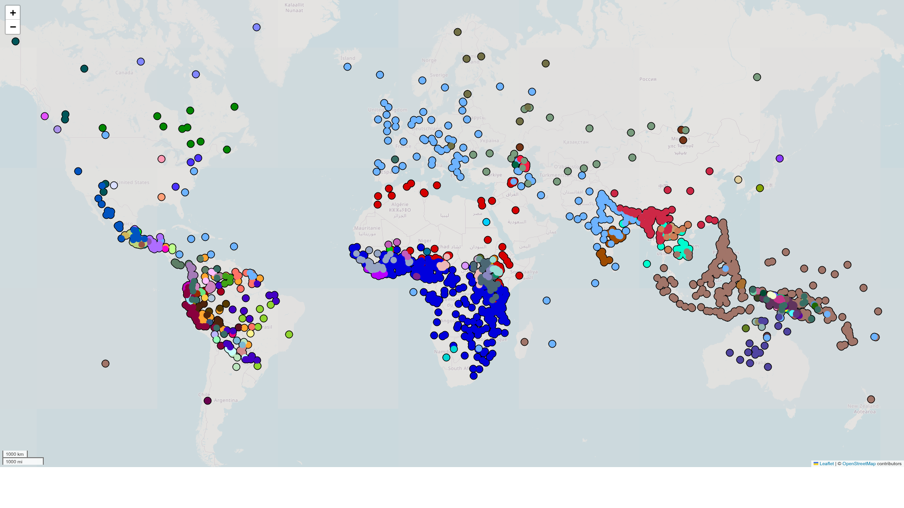

# taggedPBC

**tldr**: POS-tagged and dependency-annotated verses, initially from the Parallel Bible Corpus (PBC; [Mayer & Cysouw 2014](#1)), with Python code for extracting various metrics and making cross-linguistic comparisons. To contribute to this dataset, please refer to [Contributing](#contributing-to-this-dataset) below.

> This repository is shared under a CC BY-NC-SA 4.0 license, and can be used solely for research purposes. Copyright of the selected verses of each translation is retained by the original copyright holders.

If you use this data, please cite the following source or one (or all) of the papers listed further below:

- Ring, Hiram. 2025. The *taggedPBC*: Annotating a massive parallel corpus for crosslinguistic investigations. https://doi.org/10.48550/arXiv.2505.12560 *[Submitted on 18 May 2025]*

## Updates

**UPDATE** *01 July 2025*: Added parallel data from 346 additional languages, bringing the count of corpora to 1,945 (from 1,599). Results remain largely unchanged from initial findings reported in first drafts of papers linked here. This README and associated files in the repository have been updated with revised findings.

**UPDATE** *29 June 2025*: Removed `json` formatted corpora and converted scripts to use only CoNLL-U formatted corpora. 

## Aims and Description of the repository

The main aim of this repository is to provide a baseline dataset of parallel annotated corpora for crosslinguistic investigations. A secondary aim is to allow for ongoing annotation of corpora to support NLP for low-resource languages. As annotations are improved it is hoped that this will allow for more detailed comparisons and linguistic insights. While the first version of this dataset was developed via the Parallel Bible Corpus, it should be noted that recently updated versions source additional materials.

The three folders in this repository contain corpus data and scripts to run various analyses.

- `corpora`: contains the actual annotated data for a large number of (non-contiguous) parallel verses taken from New Testament translations in 1,945 languages (including two conlangs: Esperanto and Klingon).
- `recipes`: contains scripts that illustrate how to extract info from the corpora.
- `scripts`: contains scripts to verify and analyze the data of the `taggedPBC`, with reference to particular papers (currently draft versions of submissions to journals). Refer to [the README file](scripts/README.md) in the subfolder for additional information.

Papers related to this dataset include the following:

- Ring, Hiram. 2025. The *taggedPBC*: Annotating a massive parallel corpus for crosslinguistic investigations. https://doi.org/10.48550/arXiv.2505.12560 *[Submitted on 18 May 2025]* [Annotating README](scripts/annotating_readme.md)

- Ring, Hiram. 2025. Word length predicts word order: "Min-max"-ing drives language evolution. https://doi.org/10.48550/arXiv.2505.13913 *[Submitted on 20 May 2025]* [Word length README](scripts/wordlength_readme.md)

- Ring, Hiram. 2025. Extending dependencies to the *taggedPBC*: Word order in transitive clauses. https://doi.org/10.48550/arXiv.2506.06785 *[Submitted on 6 June 2025]* [CoNLL-U README](scripts/conllu_readme.md)

### How to access data in the repository

Individual corpora can be downloaded from the relevant subfolder. Additionally, there are scripts illustrating how to access data systematically (see the [Recipes README](recipes/README.md) for specifics). This includes accessing information by ISO code or groups of codes (such as language families via Glottolog).

### Information regarding the tagged corpora

Under the subfolder `corpora/conllu` the data contains annotations (POS, dependencies, morphological info) formatted following the [CoNLL-U Universal Dependencies conventions](https://universaldependencies.org/format.html). All corpora contain a beginning header with information on licensing and source, followed by specific verses with introductory comments and then the individual tagged words:

- `# sent_id`: the PBC verse number
- `# ref_id`: the book, chapter, verse reference
- `# eng_text`: the English text, from a Public Domain translation
- `# ISO_text`: the text of the source language, where `ISO` is the ISO639-3 code
- `# ISO_orth`: the text of the source language in the original script (if non-roman)
- `ID`	`word`	`lemma`	`UPOS`	`XPOS` `FEATS`	`HEAD`	`DEPREL`	`DEPS`	`MISC`

 The `MISC` field contains the corresponding script representation of the word (`orth=`) if the language is represented in a non-roman script, and may also contain the most likely English gloss (`gloss=`) based on word alignment, as well as morphological features transferred from English via that gloss.

The following table gives counts of verses per language in the corpora (excluding the two conlangs):

|Number of verses|Number of languages|
|--|--|
|1800+|1823|
|1500-1800|58|
|1000-1500|50|
|700-1000|12|
|**Total**|**1943**|

The following map shows the languages found in the *taggedPBC*, colored by language family.

An interactive version of this map can be generated using the [make_language_map.py](recipes/make_language_map.py) script.

## Contributing to this dataset 

Contributions to this dataset are welcome, either in the form of new data, updated annotations, or scripts that make use of the corpora for various analyses. Simply open a new issue for discussion or submit a pull request to add/change files.

There is a broad scope for improving the annotations in individual corpora. As the initial dataset provides a baseline of automatically-generated annotations, each corpus could be improved in terms of identifying accurate tags or adding additional information. Manually tagging a portion of an individual corpus for parts of speech and/or dependency information could allow for better training of part of speech and dependency taggers for that particular language. Identifying correspondences between an individual language's romanization/script and IPA characters could allow for better comparison of sound structures between languages. Each of these improvements to annotation could be facilited by (semi-)automated approaches.

Additionally, there are various kinds of analyses that could be explored with a large dataset of this type. Some ideas are presented under the `recipes` folder. Additional scripts for processing the dataset would be welcomed, as illustrations of the kinds of information that can be extracted from large-scale parallel corpora of this kind.

## References 

<a id="1">[1]</a>
Mayer, Thomas & Michael Cysouw. 2014. Creating a massively parallel Bible corpus. In Proceedings of the Ninth International Conference on Language Resources and Evaluation (LREC'14), pages 3158–3163, Reykjavik, Iceland. European Language Resources Association (ELRA). https://aclanthology.org/L14-1215/  
