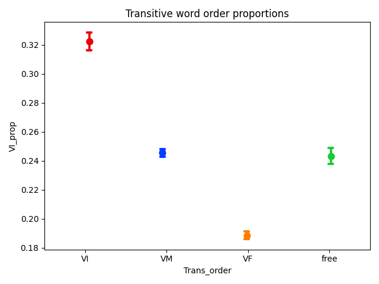
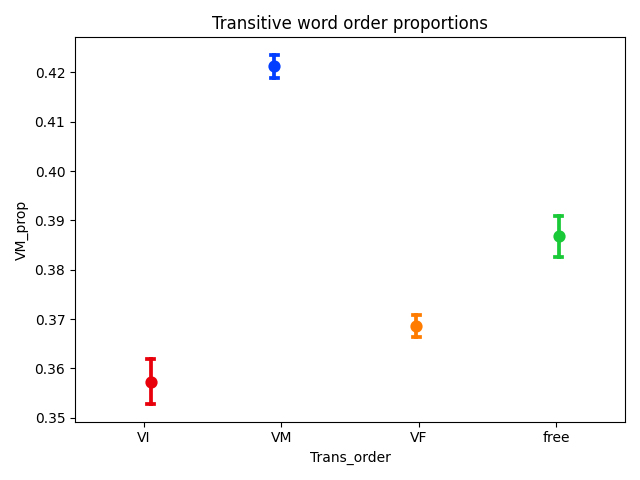
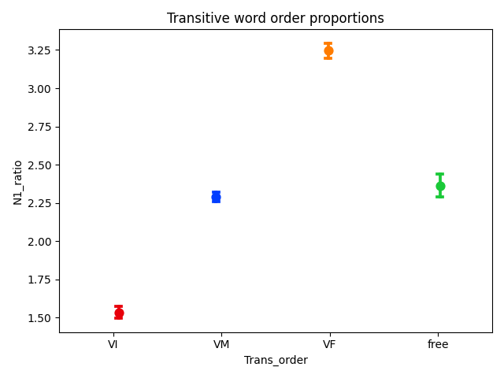

# taggedPBC

**tldr**: POS- and dependency-annotated verses from the Parallel Bible Corpus (PBC; [Mayer & Cysouw 2014](#1)), with Python code for extracting various metrics and making cross-linguistic comparisons.

> This repository is shared under a CC BY-NC-SA 4.0 license

If you make use of these scripts, please cite the following paper:
- Ring, Hiram. 2025. Extending dependencies to the *taggedPBC*: Word order in transitive clauses. https://doi.org/10.48550/arXiv.2506.06785 *[Submitted on 6 June 2025]*

Findings are based on metrics computed for each language and aggregated in the file `data/output/All_comparisons_conllu.xlsx` - this contains counts of transitive word orders for languages of the tagged PBC (based on the CoNLL-U format). The remainder of this README file describes the process used to obtain these counts.

To generate the basic stats via this repository, install the requirements (recommended in a virtual environment, Python 3.10.12). These requirements do not include all the libraries used for developing the corpus, dependencies for which can be installed manually following scripts in the `processing` folder:

`pip install -r requirements.txt`

The script associated with this readme file can then be used to run the analyses reported in the paper "[Extending dependencies to the *taggedPBC*](https://doi.org/10.48550/arXiv.2506.06785)":

`python conllu_tagging.py`

Explanation of the code and the reasoning behind it continues below.

#### Table of Contents  
[Overview of repository](#overview)  
[Overview of methodology](#methodology)  
&nbsp;&nbsp;[1. Assumptions](#assumptions)  
&nbsp;&nbsp;&nbsp;&nbsp;[1.1 Automatic POS and dependency tagging](#auto-pos)  
&nbsp;&nbsp;&nbsp;&nbsp;[1.2 Assessing accuracy](#accuracy-pos)  
&nbsp;&nbsp;[2. Word order](#id-word-order)  
&nbsp;&nbsp;&nbsp;&nbsp;[2.1 Identifying word order proportions](#word-order-in-corpora)  
&nbsp;&nbsp;&nbsp;&nbsp;[2.2 Assessing validity of proportions](#assessing-proportions)  
&nbsp;&nbsp;[References](#references)  

## Overview of repository 

This repository contains data and code to reproduce the results reported in the paper "Extending dependencies to the *taggedPBC*".

## Overview of methodology for tagging the PBC 

The methodology used here follows earlier work, where pairs of word alignment models are trained to translate words between each language in the *taggedPBC* and English. The major difference is the use of the SpaCy parser to transfer dependency and morphological annotations from English to each language corpus, along with POS information. The resulting annotations are then written to the CoNLL-U format used by the Universal Dependencies Treebanks project.

### 1. Assumptions 

The original corpus (the Parallel Bible Corpus, PBC; [Mayer & Cysouw 2014](#1)) contains portions of the Bible in over 2000 languages. The *taggedPBC* contains a reduced set of verses for 1597 modern languages (as well as 2 conlangs). All these scripts have been romanized for comparison.

#### 1.1 Automatic POS and dependency tagging using cross-lingual transfer 

Transferring POS tags from high-resource languages has been shown to work relatively well for word classes with many members, such as Nouns and Verbs ([Agic et al 2015](#4); [Imani et al 2022](#5)). It is not completely clear that this is also the case for dependencies. However, given that these are parallel sentences/verses, where each language is trying to accurately represent the *meaning* of the source text (the original Greek/Hebrew in most cases), we can generally assume that translation equivalents will also have the same dependencies. Accordingly, if an English word is tagged as having the 'subject' relation in a sentence/verse, its translation equivalent in that same verse for a given language is tagged with the same relation.

#### 1.2 Assessing the accuracy of the dependencies 

At the moment this is still a work in progress, whereby I am assessing how well automatically transferred dependencies align with human-annotated dependencies. However, there is some indication that even the coarse-grained annotations derived from the automated process align with typological observations regarding transitive word order, as is shown below.

### 2. Word order for languages in the tagged corpus 

As noted in previous work in this repository, by “word order” most researchers refer to the relative order of referential arguments (nouns) versus predicates (verbs), such that it is possible to talk about “verb-initial” vs “verb-final” or “verb-medial” languages, as well as grammatical constructs like Subject and Object in relation to the position of the Verb. Here, we are not strictly talking about the "noun" and "verb" word class, since Subjects and Objects are often pronouns or demonstratives rather than bare nouns. Predicates, similarly, are not solely verbs in all languages.

The main drawback of the previous version of the *taggedPBC* with respect to word order is that it only annotated POS and did not identify dependency relations at all. This means that word order observations were limited to intransitive patterns. In contrast, the CoNLL-U version of the corpora transfers `subject` and `object` relations. When combined with verbs, this allows for observation of transitive patterns in each corpus.

#### 2.1 Identifying word order in corpora via proportions 

In order to identify these relations in corpora I use the following procedure for each language in the tagged PBC corpus:

1. For each verse, track the index of words tagged as `subject`, `object`, and `verb`
2. If two or more elements are found in the sentence, count the order in which they occur
3. Divide each count of orders by the total number of verses found with the same number/kind of elements

This gives a set of proportions regarding the relative number of each order found in each language.

#### 2.2 Assessing the validity of the proportions 

To test whether these proportions identify transitive word order in language, similarly to "The *taggedPBC*" paper, I compare the proportions with classification of languages in existing typological databases: the World Atlas of Language Structures ([WALS](https://wals.info/); [Dryer & Haspelmath 2013](#6)), the [AUTOTYP](https://github.com/autotyp/autotyp-data) database ([Bickel et al., 2022](#7)), and [Grambank](https://grambank.clld.org/) ([Skirgård et al., 2023](#8)). These databases contain determinations of word order in many of the languages contained in the *tagged PBC* corpus. For comparative purposes, I convert all classifications to Verb-initial (VI), Verb-medial (VM), Verb-final (VM) and "free". Also due to the nature of the investigation, I combine all databases into a single set of 966 observations where the databases share ISO codes with languages in the *taggedPBC*.

##### 2.2.1 Verb-initial proportions

Here we can see that the proportion of Verb-initial sentences is highest for languages classed as Verb-initial by the databases. Further, this proportion significantly differentiates between VI, VM, and VF languages, but does not differentiate between "free" and VM languages (see [results of ANOVA](data/output/plots_wdorder/Trans_order_VI_prop_posthoc.txt)).

##### 2.2.2 Verb-medial proportions

Here we see that the proportion of Verb-medial sentences is highest for languages classed as Verb-medial by the databases. Further, while the proportion significantly differentiates between most word order classifications, it is only marginally significant for differentiating between VI and VF languages (see [results of ANOVA](data/output/plots_wdorder/Trans_order_VM_prop_posthoc.txt)).

##### 2.2.3 Verb-final proportions

In this plot we see that the proportion of Verb-final sentences is highest for languages classed as Verb-final by the databases. Although the proportion also significantly differentiates between all word order classifications, it is not as significant for differentiating between VI and VM languages (see [results of ANOVA](data/output/plots_wdorder/Trans_order_VF_prop_posthoc.txt)).

##### 2.2.4 Transitive orders and the N1 ratio

Interestingly, the N1 ratio significantly differentiates between all word order classifications, as it did with intransitive word order (see [results of ANOVA](data/output/plots_wdorder/Trans_order_N1_ratio_posthoc.txt)).

##### Summary of word order

We can see here that corpus statistics, both proportions of word orders as well as the N1 ratio, align pretty well (and highly significantly) with word order classifications in typological databases.

## References 

<a id="1">[1]</a>
Mayer, Thomas & Michael Cysouw. 2014. Creating a massively parallel Bible corpus. In Proceedings of the Ninth International Conference on Language Resources and Evaluation (LREC'14), pages 3158–3163, Reykjavik, Iceland. European Language Resources Association (ELRA). https://aclanthology.org/L14-1215/  

<a id="2">[2]</a>
Zeman, Daniel, et al. 2024. Universal Dependencies 2.14. LINDAT/CLARIAH-CZ digital library at the Institute of Formal and Applied Linguistics (ÚFAL), Faculty of Mathematics and Physics, Charles University, http://hdl.handle.net/11234/1-5502 (online at https://universaldependencies.org/ )  

<a id="3">[3]</a>
Hahn, M., & Y. Xu. 2022. Crosslinguistic word order variation reflects evolutionary pressures of dependency and information locality, Proc. Natl. Acad. Sci. U.S.A. 119 (24) e2122604119, https://doi.org/10.1073/pnas.2122604119.  

<a id="4">[4]</a>
Agić, Željko, Dirk Hovy, & Anders Søgaard. 2015. If all you have is a bit of the Bible: Learning POS taggers for truly low-resource languages. In Proceedings of the 53rd Annual Meeting of the Association for Computational Linguistics and the 7th International Joint Conference on Natural Language Processing (Volume 2: Short Papers), pages 268–272, Beijing, China. Association for Computational Linguistics. https://aclanthology.org/P15-2044/   

<a id="5">[5]</a>
Imani, Ayyoob, et al. 2022. Graph-Based Multilingual Label Propagation for Low-Resource Part-of-Speech Tagging. In Proceedings of the 2022 Conference on Empirical Methods in Natural Language Processing, pages 1577–1589, Abu Dhabi, United Arab Emirates. Association for Computational Linguistics. https://aclanthology.org/2022.emnlp-main.102/  

<a id="6">[6]</a>
Dryer, Matthew S. & Haspelmath, Martin (eds.) 2013.
The World Atlas of Language Structures Online.
Leipzig: Max Planck Institute for Evolutionary Anthropology.
(Available online at http://wals.info )  

<a id="7">[7]</a>
Bickel, Balthasar, et al. 2022. The AUTOTYP database (v1.1.1). https://doi.org/10.5281/zenodo.7976754  

<a id="8">[8]</a>
Skirgård, Hedvig et al. 2023. Grambank v1.0 (v1.0.3) [Data set]. Zenodo. https://doi.org/10.5281/zenodo.7844558 (online at https://grambank.clld.org/ )
