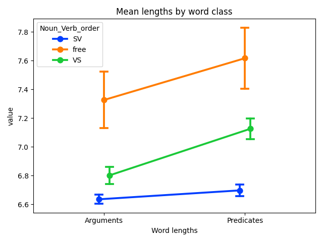
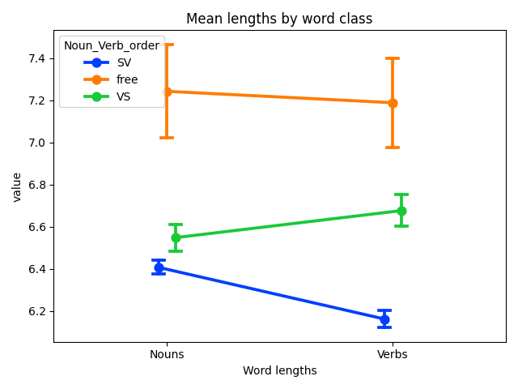

# taggedPBC

**tldr**: POS-tagged verses from the Parallel Bible Corpus (PBC; [Mayer & Cysouw 2014](#1)), with Python code for extracting various metrics and making cross-linguistic comparisons.

> This repository is shared under a CC BY-NC-SA 4.0 license

If you make use of these scripts, please cite the following paper:
- Ring, Hiram. 2025. Word length predicts word order: "Min-max"-ing drives language evolution. https://doi.org/10.48550/arXiv.2505.13913 *[Submitted on 20 May 2025]*

Findings are based on metrics computed for each language and aggregated in the file `data/output/All_comparisons_imputed.xlsx` - this contains measurements for word types in languages of the tagged PBC. The remainder of this README file describes the process used to obtain these measurements.

To generate the basic stats via this repository, install the requirements (recommended in a virtual environment, Python 3.10.12). These requirements do not include all the libraries used for developing the corpus, dependencies for which can be installed manually following scripts in the `processing` folder:

`pip install -r requirements.txt`

The script associated with this readme file can then be used to run the analyses reported in the paper "Word length predicts word order: "Min-Max"-ing drives language evolution":

`python wordlength_taggedPBC.py`

Explanation of the code and the reasoning behind it continues at length below.

#### Table of Contents  
[Overview of repository](#overview)  
&nbsp;&nbsp;[Comparing word length and word order](#compare-averages)  
&nbsp;&nbsp;&nbsp;&nbsp;[1 Results](#results)  
&nbsp;&nbsp;&nbsp;&nbsp;[2 Testing predictive validity](#testing-predictive-validity)  
&nbsp;&nbsp;&nbsp;&nbsp;[3 Testing descent](#testing-descent)  
&nbsp;&nbsp;&nbsp;&nbsp;[4 Discussion](#discussion)  
&nbsp;&nbsp;[References](#references)  

# Overview of repository 

This repository contains data and code to reproduce the results reported in the paper "Word length predicts word order". To conduct these analyses, simply run the `wordlength_taggedPBC.py` script, which assumes that you have generated the relevant spreadsheets via the `annotating_taggedPBC.py` script. These analyses and tests are described in greater detail below and via annotations within the scripts themselves.

## Comparing average word lengths and word order across languages 

The investigation described in "The taggedPBC" has established that based on corpora we can (with a high degree of certainty):

1. identify word classes for nouns/arguments and verbs/predicates for languages, and
2. identify word order for languages

Now we can proceed to an investigation of the primary hypothesis of the current paper "Word length predicts word order", based on Wasow's (2002) claim, that shorter words/classes occur first in a sentence crosslinguistically. This would suggest that SV languages have shorter nouns/arguments than verbs/predicates and VS languages have longer nouns/arguments than verbs/predicates, while free word order languages do not have shorter nouns/arguments than verbs/predicates.

To investigate this, we can simply count the number of nouns/arguments and get an average of their lengths in each language, and do the same for verbs/predicates. Then we can conduct statistical tests (a repeated measures ANOVA) to see if there is a significant effect of these measures in relation to (SV, VS, free) word order.

There are several conditions that we can consider in our investigation, and which the methodology used to construct the tagged PBC dataset makes relatively easy to test. For example, we know that 'noun' is a subclass of "argument" in languages of the world, such that the latter is a larger group of words that contain pronouns and other referential words such as demonstratives and proper nouns (or names). We also know that 'verb' is a subclass of "predicate", such that words classed as auxiliaries can also serve verbal functions. Another consideration is that there is known to be a frequency effect on word processing ([Brysbaert et al 2018](#10)), which should be taken into account when investigating words in a corpus.

Each of these considerations can be dealt with in our investigation by simply adjusting how we count words and measure lengths. This results in the following four conditions:

1. Arguments/Predicates: count unique [NOUN, PRO, PROPN] and [VERB, AUX] for each language, average their lengths
2. Arguments/Predicates Freq: count all [NOUN, PRO, PROPN] and [VERB, AUX] for each language, average their lengths
3. Nouns/Verbs: count unique [NOUN] and [VERB] for each language, average their lengths
4. Nouns/Verbs Freq: count all [NOUN] and [VERB] for each language, average their lengths

For conditions 1 and 3, we are getting the unique set of Argument(s)/Noun(s) and Predicate(s)/Verb(s) but differentiating based on the members of each class to see if there is an effect of average word length on word order. For conditions 2 and 4, we are instead seeing if word frequency (i.e. frequency of shorter/longer words in each class within the corpus) mediates an effect of average word length on word order.

### 1 Results 

The results are quite striking, with all conditions except for #4 showing a main effect whereby nouns/arguments are shorter than verbs/predicates in all languages (p < 0.001). Further, nouns/verbs tend to be shorter in SV languages than VS languages, and shorter in VS languages than free word order languages.

The only condition where this is not the case is where we compare only nouns/verbs and allow for frequency effects. That is, when we consider only words tagged as nouns (excluding pronouns and proper nouns) and only words tagged as verbs (excluding auxiliaries), and allow for their relative frequencies to affect the average length of the word class (i.e. a higher frequency of a particular short noun brings the average length of nouns down), we see the opposite pattern. In this condition, nouns are shorter than verbs in VS languages, while nouns are longer than verbs in SV languages, and this length difference is significant (p < 0.001).

### 2 Testing predictive validity of word lengths 

This finding suggests that word class length is a factor in how word order is realized in language, but how real is this apparent effect? One way of assessing the strength of this effect is to see whether the relative length of nouns and verbs can predict word order in corpora. That is, can we determine, based on just the relative length of nouns and verbs in tagged corpora, what the language's basic word order is? To investigate this question we can test how well a classifier is able to identify different word orders based on this feature.

Further, with historical corpora, if we can identify a language in which word order has changed from a previous pattern, being able to differentiate the two states would also demonstrate the likely interaction of word length change with word order change. As an example, Ancient Hebrew had a VS basic word order, but Modern Hebrew is SV. Can we use corpora of these two languages to answer this question? In fact, yes: it turns out that the UDT contains tagged corpora for both Ancient Hebrew (ISO639-3: hbo) and Modern Hebrew (ISO639-3: heb).

As a second verification step I additionally sourced data from two other related languages where word order changed: Classical Arabic (here I give it the abbreviation `cla`, which is unassigned in the ISO639-3 code tables) and Egyptian Arabic (ISO639-3: arz). Classical Arabic (the language of the Quran) is VS like many other Semitic languages. It was brought to Egypt in the seventh century CE and subsequently developed into modern Egyptian Arabic, which is SV. Data for Classical Arabic was taken from the POS-tagged [Quranic Arabic Corpus V0.4](https://corpus.quran.com/). Data for Egyptian Arabic are from the tagged [BOLT Egyptian Arabic Treebank - Discussion Forum](https://catalog.ldc.upenn.edu/LDC2018T23).

The data in each corpus (UDT, Quranic Arabic, and BOLT) require some additional processing to convert the tagged sentences to the format of the *tagged PBC*, and all the corpora need to be romanized using the `uroman` tool. Additionally, the Quranic Arabic Corpus data is stored in an ASCII transliteration that uses the Buckwalter transcription system. This can be [converted to Arabic unicode script](https://github.com/andyroberts/buckwalter2unicode) via code conversion tables before being romanized.

Statistics taken from these corpora in the same manner as for the tagged PBC are stored in `checks/test_hist/corpora_stats.xlsx` (the process can be replicated by running `checks/test_hist/check_corpora.py`, provided you have processed the corpus files appropriately), and running the code `checks/test_hist/classify_lgs.py` trains a GNB classifier and outputs the results. The following table displays some of the statistical properties of the respective corpora. We can note that the UDT data has fewer sentences, which simply reflects the fact that not all available tagged data for those languages has been converted to the UDT format.

| Language | ISO 639-3 | Data Source | Sentences | Unique nouns | Unique verbs |
| --------- | ----- | ------ | ------ | ------ | -------- |
| A. Hebrew | hbo   | UDT    | 409    | 734    | 782      |
| M. Hebrew | heb   | UDT    | 882    | 2,068  | 1,297    |
| C. Arabic | cla   | Quran  | 6,236  | 8,243  | 7,966    |
| E. Arabic | arz   | BOLT   | 31,688 | 16,698 | 10,581   |

Importantly, 3 additional features are added to the training data besides the average lengths of Nouns/Verbs for each language, in order to expand the dimensionality of the construct. The first is a categorical feature: whether Nouns or Verbs in a language are longer. The second is a continuous feature: the ratio of noun length to verb length. This measure is related to "entropy", whereby a lower ratio indicates that the two word classes are less likely to be differentiable (and therefore predictable) based on their length. The third added feature is also continous: the difference between lengths of nouns and verbs in each language. This measure is related to "efficiency", based on the idea that a larger difference between word classes may affect the likelihood of that particular class being placed first.

Training the model with these five features on the known word order data from the typological databases gives an accuracy of 66% on the test set, while training with the imputed word order gives an accuracy of 68%. In both cases, the trained classifier accurately classifies Ancient Hebrew as VS, Modern Hebrew as SV, Classical Arabic as VS, and Egyptian Arabic as SV, based on the data extracted from the respective corpora.

### 3 Testing descent from a common ancestor 

In an influential paper, [Dunn et al (2011)](#11) showed that descent from a common ancestor was a better predictor of a large number of grammatical patterns than other explanations. Although [Jäger & Wahle (2021)](#12) counter this finding with additional data, we can also assess this claim using the current dataset to see if descent is more explanatory of word order for a given language than the lengths of nouns and verbs. This investigation can proceed with several (motivated) simplifying assumptions regarding the family relationships.

First, for each language we can take the highest level node of family membership that is known based on current scholarship. This is because all modern languages are the same age, and while their pathways/histories may differ, this does not impact whether they can be considered part of the same related tree. That is, if descent is more explanatory than word class length, we would expect languages belonging to the same tree to have a higher likelihood of sharing the same word order than not.

Second, we can run various analyses with differing datasets in order to see how this affects the statistical robustness of the findings. It may be, for example, that using a smaller sample gives a different result than a larger or more diverse one. Here, the more languages we have for a language family, the higher the likelihood that any relationship identified is not due to chance.

Finally, we can remove languages with "free" word order from consideration, as this leaves us with a binary distinction in word order (SV-VS) that opens up more possibilities for statistical tools.

In particular, the use of a binary dependent variable for word order means we can use a statistical method called "hierarchical linear regression". This technique allows us to observe the relative impact of particular features that are theoretically relevant to the question at hand by seeing how they influence the performance of successive models. In the case of word order, we can train a regression model with a feature known to be relevant to word order (the N1 ratio), and then subsequent models that incorporate additional features of interest ("language area", "family membership", "noun/verb lengths"). We can then compare the models to see whether the additional features increase the variance explained in the data via the F-score: an increase in F-score and its significance indicates more variance explained by the particular feature added in a model.

Accordingly, using the ISO codes, I retrieved the family membership for all languages in the taggedPBC from [Glottolog](https://glottolog.org/). Then I filtered the taggedPBC data on four conditions:
1. `Dunn_lgs_tPBC`: languages found in the Dunn et al paper that are also present in the taggedPBC (106 languages)
2. `Dunn_fams_tPBC`: languages found in the taggedPBC that are in the four families investigated by Dunn et al (539 languages)
3. `>75_lg_families`: languages in families with more than 75 members in the taggedPBC (962 languages)
4. `>1_lg_families`: languages in families with 2 or more members in the taggedPBC (1486 languages)

For each of these conditions, we can run a hierarchical linear regression (`checks/hierlinreg.py` or via `wordlength_taggedPBC.py`) with the N1 ratio as primary feature of the base model, then incorporate language area (a combination of macro area and GPS coordinates as identified by Glottolog) as a feature in the second model, add in the feature of family membership (descent) to the third model, and then noun/verb lengths (frequency weighted) to the fourth model. This gives us the following results:

 Dunn_lgs results:

 |Model|N (obs)|F-val|P-val (F)|F-val change|P-val (F-val change) |
 |-----|-------|-----|---------|------------|---------------------|
 |1    |106    |45.84|7.8e-10  |            |                     |
 |2    |106    |20.40|2.4e-12  |8.58        |3.9e-05              |
 |3    |106    |16.69|5.7e-12  |1.47        |0.226                |
 |4    |106    |13.40|4.9e-12  |3.26        |0.042                |

 Dunn_fams results:

 |Model|N (obs)|F-val|P-val (F)|F-val change|P-val (F-val change) |
 |-----|-------|-----|---------|------------|---------------------|
 |1    |539    |230.40|1.4e-43 |            |                     |
 |2    |539    |100.00|1.7e-63 |39.86       |2.9e-23              |
 |3    |539    |80.71 |5.3e-63 |2.45        |0.117                |
 |4    |539    |64.75 |3.5e-67 |14.57       |6.9e-07              |

 \>75_lg_families results:

 |Model|N (obs)|F-val |P-val (F) |F-val change|P-val (F-val change) |
 |-----|-------|------|----------|------------|---------------------|
 |1    |962    |426.73|9.9e-79   |            |                     |
 |2    |962    |220.48|4.2e-134  |105.35      |6.1e-59              |
 |3    |962    |176.22|6.6e-133  |0.041       |0.839                |
 |4    |962    |130.93|8.3e-135  |9.69        |6.7e-05              |

 \>1_lg_families results:

 |Model|N (obs)|F-val  |P-val (F) |F-val change |P-val (F-val change) |
 |-----|-------|-------|----------|-------------|---------------------|
 |1    |1486   |586.46 |1.8e-109  |             |                     |
 |2    |1486   |193.60 |1.3e-133  |45.19        |6.0e-28              |
 |3    |1486   |155.09 |1.2e-132  |1.03         |0.309                |
 |4    |1486   |115.43 |3.5e-135  |11.02        |1.7e-05              |

From these analyses we can see that the length of nouns and verbs in a language accounts for more variance and at the same time is more significant than that language's family membership in determining its word order classification.

### 4 Discussion 

The results suggest some interesting nuances to the discussion of processing and word order. First, Wasow's claim is supported to some degree, in that when we consider "arguments" as a larger class, the tendency crosslinguistically is for such arguments to be shorter than verbs/predicates. Given that non-noun arguments (pronouns, proper nouns) are quite frequent in usage, this may provide some pressure (via the principle of "efficiency") for languages to place such items first in a sentence.

The surprising finding that nouns (on their own) are longer than verbs (on their own) in SV languages, and that the opposite is true for VS languages, suggests another pressure whereby languages present more difficult-to-process information (or perhaps words that are more informative) first. This may provide an explanation for why VS languages are relatively stable despite the pressure provided by the use of easy-to-parse non-noun arguments.

Additionally, it is quite striking that measuring the length of nouns and verbs in corpora can allow us to accurately classify word order in Hebrew and Arabic. The classifier is assessing data rather different from the tagged PBC, taken from two time points in different languages in which word order is known to have changed. This indicates that there is a real effect of word class length on how word order develops over time.

Finally, hierarchical linear regression shows that word class length is more explanatory than family membership in relation to a language's word order.

## References 

<a id="1">[1]</a>
Mayer, Thomas & Michael Cysouw. 2014. Creating a massively parallel Bible corpus. In Proceedings of the Ninth International Conference on Language Resources and Evaluation (LREC'14), pages 3158–3163, Reykjavik, Iceland. European Language Resources Association (ELRA). https://aclanthology.org/L14-1215/  

<a id="2">[2]</a>
Zeman, Daniel, et al. 2024. Universal Dependencies 2.14. LINDAT/CLARIAH-CZ digital library at the Institute of Formal and Applied Linguistics (ÚFAL), Faculty of Mathematics and Physics, Charles University, http://hdl.handle.net/11234/1-5502 (online at https://universaldependencies.org/ )  

<a id="3">[3]</a>
Hahn, M., & Y. Xu. 2022. Crosslinguistic word order variation reflects evolutionary pressures of dependency and information locality, Proc. Natl. Acad. Sci. U.S.A. 119 (24) e2122604119, https://doi.org/10.1073/pnas.2122604119.  

<a id="4">[4]</a>
Agić, Željko, Dirk Hovy, & Anders Søgaard. 2015. If all you have is a bit of the Bible: Learning POS taggers for truly low-resource languages. In Proceedings of the 53rd Annual Meeting of the Association for Computational Linguistics and the 7th International Joint Conference on Natural Language Processing (Volume 2: Short Papers), pages 268–272, Beijing, China. Association for Computational Linguistics. https://aclanthology.org/P15-2044/   

<a id="5">[5]</a>
Imani, Ayyoob, et al. 2022. Graph-Based Multilingual Label Propagation for Low-Resource Part-of-Speech Tagging. In Proceedings of the 2022 Conference on Empirical Methods in Natural Language Processing, pages 1577–1589, Abu Dhabi, United Arab Emirates. Association for Computational Linguistics. https://aclanthology.org/2022.emnlp-main.102/  

<a id="6">[6]</a>
Wasow, Thomas. 2002. Postverbal Behavior. CSLI Publications.  

<a id="7">[7]</a>
Dryer, Matthew S. & Haspelmath, Martin (eds.) 2013.
The World Atlas of Language Structures Online.
Leipzig: Max Planck Institute for Evolutionary Anthropology.
(Available online at http://wals.info )  

<a id="8">[8]</a>
Bickel, Balthasar, et al. 2022. The AUTOTYP database (v1.1.1). https://doi.org/10.5281/zenodo.7976754  

<a id="9">[9]</a>
Skirgård, Hedvig et al. 2023. Grambank v1.0 (v1.0.3) [Data set]. Zenodo. https://doi.org/10.5281/zenodo.7844558 (online at https://grambank.clld.org/ )  

<a id="10">[10]</a>
Brysbaert, M., Mandera, P., & Keuleers, E. 2018. The Word Frequency Effect in Word Processing: An Updated Review. Current Directions in Psychological Science, 27(1), 45-50. https://doi.org/10.1177/0963721417727521  

<a id="11">[11]</a>
Dunn, M., Greenhill, S., Levinson, S. et al. 2011. Evolved structure of language shows lineage-specific trends in word-order universals. Nature 473, 79–82. https://doi.org/10.1038/nature09923  

<a id="12">[12]</a>
Jäger, G. and Wahle, J. 2021. Phylogenetic Typology. Front. Psychol. 12:682132. doi: 10.3389/fpsyg.2021.682132  
